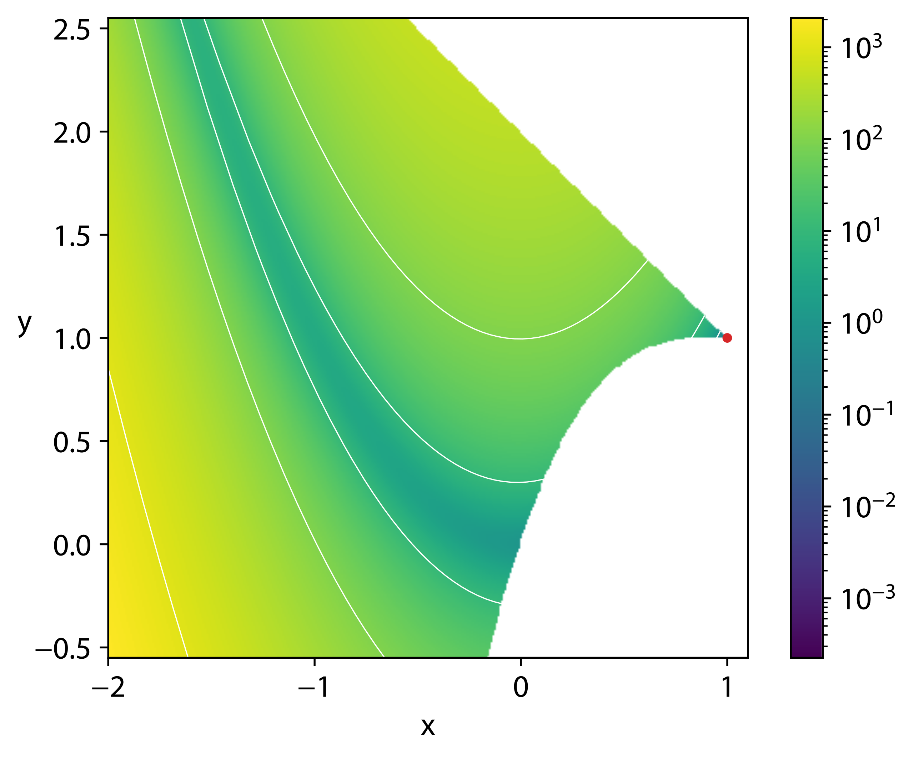

# A C++ Implementation of Adaptive Simulated Annealing

This is an implementation of the Adaptive Simulated Annealing (ASA) algorithm in C++17 with multithreading and multistart support.
ASA is a metaheuristic for the optimisation of single-objective mixed-integer non-linear constrained optimisation problems, and is described in:
  
  1. Ingber, L. (1989). Very fast simulated re-annealing. Mathematical and computer modelling, 12(8), 967-973.
  2. Ingber, L. (1993). Adaptive simulated annealing (ASA). Global optimization C-code, Caltech Alumni Association, Pasadena, CA.
  3. Ingber, L. (1993). Simulated annealing: Practice versus theory. Mathematical and computer modelling, 18(11), 29-57.
  4. Ingber, L. (2000). Adaptive simulated annealing (ASA): Lessons learned. arXiv preprint cs/0001018.
  
  ## About
  The code does not use any external libraries, and should successfully compile on any C++17 standard-compliant compiler, on all operating systems and architectures for which such a compiler is available (it has been tested on Windows/Linux). Multi-threaded support is provided using [this thread pool implementation](https://github.com/bshoshany/thread-pool/).
  It can succesfully find the optimal solution on most [test functions for optimisation](https://en.wikipedia.org/wiki/Test_functions_for_optimization).

  The program `rosenbrockConstrained.cpp` provides a full usage example with Rosenbrock function constrained with a cubic and a line, for which ASA can succesfully find the optimum point f(1, 1) = 0. The program was compiled without warnings with the warning flags `-Wall -Wpedantic -Wextra -Wconversion -Wshadow` in GCC/Clang.

  For maximum performance, it is recommended to compile with all available compiler optimizations: `-Ofast` in GCC/Clang. 

  ## Quick Example

In the example we minimize the
[Rosenbrock function constrained with a cubic and a line](https://en.wikipedia.org/wiki/Test_functions_for_optimization). The search space, admissible region and optimum at (1,1) are shown in the figure below.




We start by defining the function itself:

```.cpp
#include <cmath>    // for the objective and constraints functions

// Objective function
double objFunc(std::vector<double> &x){
    return std::pow( (1 - x[0]), 2.0 ) + 100 * std::pow((x[1] - x[0] * x[0]), 2.0);
}
```

The next thing needed is the function that implements the constraints (which is optional - it can be disregarded for non-constrained problems):

```.cpp
std::vector<bool> constrFunc(std::vector<double> &x){ 

    std::vector<bool> constraintVec(2, true);
    constraintVec[0] = std::pow(x[0] - 1.0, 3.0) - x[1] + 1.0 <= 0;
    constraintVec[1] = x[0] + x[1] - 2.0 <= 0;

    return constraintVec;
}
```

The minimisation process is then computed as:

```.cpp
#include "ASA.hpp"
#include <iostream> // to print results

int main(void)
{
    ASA Sa;// Initialise ASA object (w/ default parameters here)
    
    std::vector<double> lowBound = {-1.5, -0.5};    // Set lower bound
    std::vector<double> upBound  = {1.5, 2.5};      // Set upper bound
    std::vector<bool>   intVars  = {false, false};  // Set a boolean vector indicating integer variables
    unsigned threads     = 5;                       // Number of threads to be used
    unsigned multistarts = 5;                       // Number of multistarts to be performed

    // Minimise the problem
    std::vector<double> xOpt = 
        Sa.minimize(objFunc, lowBound, upBound,intVars, threads, multistarts, constrFunc);
    
    // Print result
    std::cout << "Optimal point: ";
    for(double v: xOpt) { std::cout << v << ", "; }
    std::cout << "Optimal cost: " << Rosenfunction(xOpt) << std::endl;
}
```
The output of this program looks like this:

```.cpp
Optimal point: 1, 1, Optimal cost: 7.36264e-20
```
which corresponds to the real optimum.

## ASA parameters
The ASA object itself contains a set of parameters, the full set of which is shown below (the example contains default values). Most of the problems tested can be solved with the default parameters and a small number of multistarts (<10). 

```.cpp
ASA Sa(double   TemperatureRatioScale       = 1e-5, 
       double   TemperatureAnnealScale      = 1e2, 
       double   costScaleRatio              = 1.0,
       double   acceptanceToGenerationRatio = 1e-2,
       double   costPrecision               = 1e-18,
       unsigned generationFrequencyModulus  = 1e4, 
       unsigned acceptanceFrequencyModulus  = 1e2, 
       unsigned maximumCostRepetitions      = 10,
       unsigned maxGeneratedStates          = 99999,
       unsigned maxAcceptedStates           = 5e4,
       unsigned numberCostSamples           = 30);
```

The meaning of each parameter, and set of reasonable values can be found in the references provided in the beginning.
